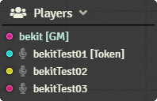
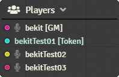
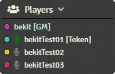
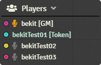
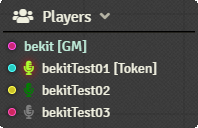
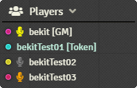
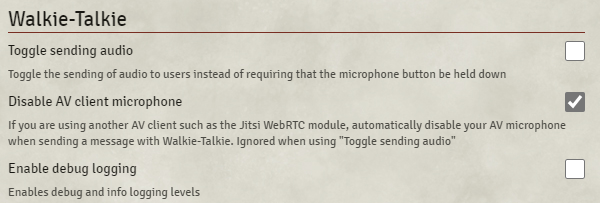

# Walkie-Talkie for FoundryVTT

### **What is Walkie-Talkie**

Transmit voice chat to an individual with a push-to-talk microphone.

Are you running a game and the bard just decided to step through the magic portal by himself? Are you a player and want to use the message spell for a secret between you and another player? Does a warlock patron need to speak to his underling without the rest of the party knowing about the influence?

Walkie-Talkie is for any situation where one-to-one audio is needed.

### **What it is not**

Walkie-Talkie is not meant as a replacement for a full AV client. It can work beside and in addition to these clients.

Walkie-Talkie will also not help in situations with interesting network challenges. This module relies on websockets and STUN/TURN WebRTC protocols. It may not be able to establish a connection between peers in all cases, and it will not work in low-bandwidth situations. However, the connection is as lightweight as possible; so it may work in some situations where a heavier AV client doesn't.

## Installation

You can install this module through the FVTT module browser or by using the following manifest URL: https://github.com/bekriebel/fvtt-module-walkie-talkie/releases/latest/download/module.json

## How to use

By default, Walkie-Talkie does not not establish any connections between users. This helps prevent any unnecessary resources from being used. When users first connect, they will see a grey icon next to each other user in the FVTT Player List to indicate that no connection is established.

To establish a connection to another user, simply click the microphone next to their name, this will attempt to establish a two way connection between the users. If the connection is fully established with an audio connection, the microphone will turn dark green.

If the connection is established, but unable to send audio (e.g., if the user denied access to their microphone), the microphone will turn orange to indicate that they are connected and may receive audio, but cannot send audio.

To transmit audio, click and hold down on the microphone next to the user you want to send to. Your microphone will turn bright green to show that you are sending your audio. If you are receiving audio from another user, the microphone next to that user will highlight in yellow.

To change the microphone or audio output device used by Walkie-Talkie, you can change the Audio Capture Device or Audio Output Device under the standard FVTT Audio/Video Configuration settings.

### **Module Options**

**Toggle sending audio** - _Default off_

Changes the default push-to-talk microphone behavior to a toggle. With this enabled, it's possible to transmit audio to more than one user at a time.

**Disable AV client microphone** - _Default on_

If using another AV Client for full communication, this option automatically activates mute on the main AV client so your audio is only sent through Walkie-Talkie when pressing a microphone. This option is ignored if _Toggle sending audio_ is enabled.

**Enable debug logging** - _Default off_

Increases the logging level of the module. Useful for debugging connection issues.

## Known limitations

- Currently no way to adjust volume of received audio - [enhancement tracking](https://github.com/bekriebel/fvtt-module-walkie-talkie/issues/1)

## Changelog

See [CHANGELOG](/CHANGELOG.md)

## Support my work

